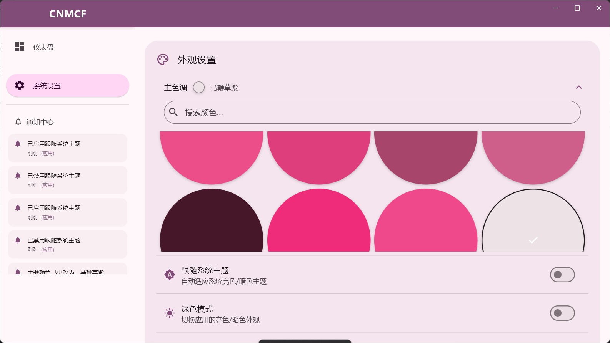
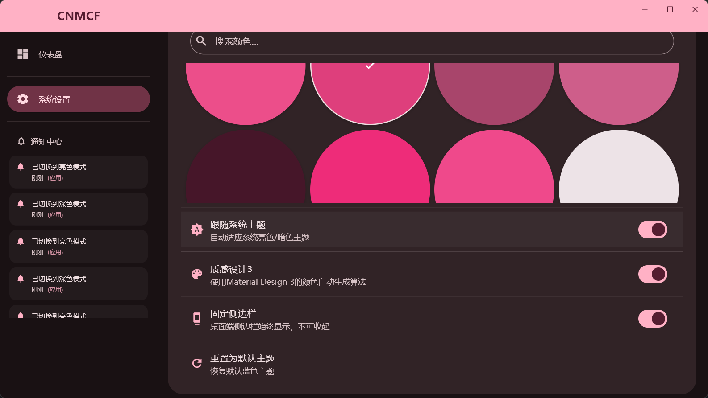
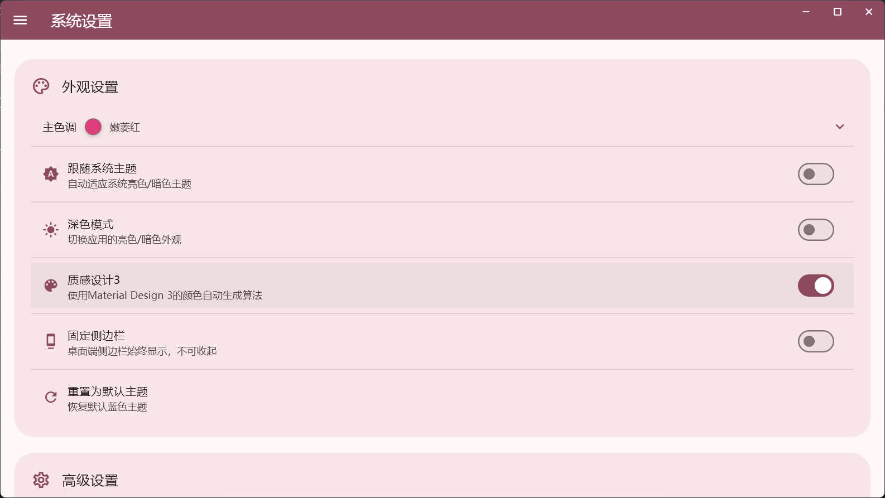
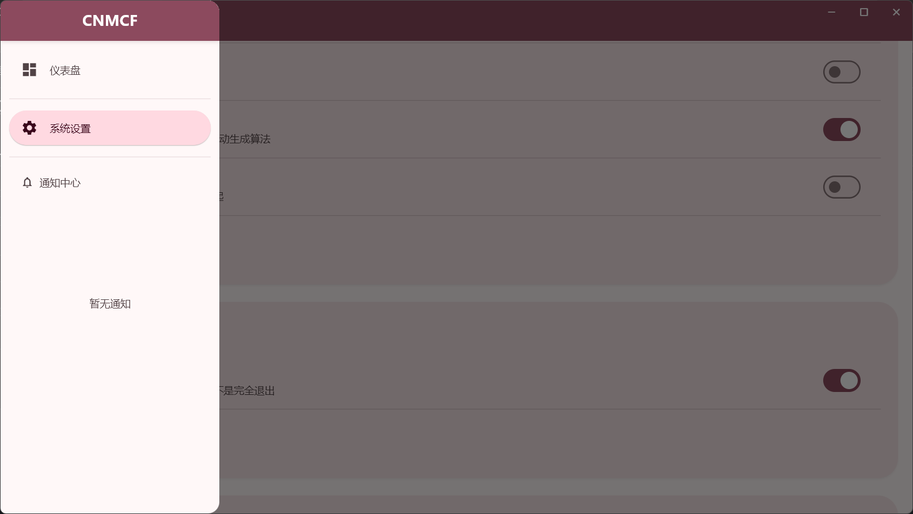
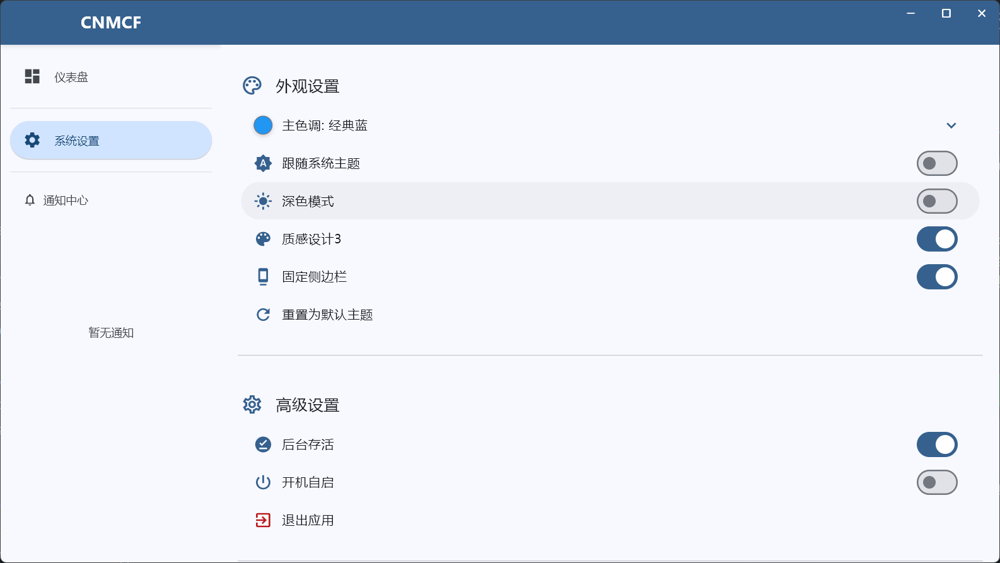

# CNMCF - Flutter创建的美化框架应用

这是一个使用 Flutter 框架构建的多平台应用程序，界面美化采用了 Google Material 3设计规范。
## 顶栏救过我的命！！！

## 页面介绍

本项目包含以下主要页面：

### 仪表盘 (`lib\pages\dashboard_page.dart`)

仪表盘页面是应用的起始页，目前展示一个简单的“创建成功”消息，并带有一个勾选图标，表示所有组件已成功创建。这是一个基础的占位页面，未来可以扩展以展示更多应用概览信息。



### 主页 (`lib\pages\home_page.dart`)

主页是应用的主要布局结构，负责组织顶部栏、侧边栏和内容区域。它根据平台（桌面或移动）和用户设置（是否固定侧边栏）来动态调整布局。主页管理页面之间的切换，并提供了获取当前BuildContext的方法供其他页面使用。



### 系统设置 (`lib\pages\settings_page.dart`)

系统设置页面提供了应用程序的外观和高级设置选项。用户可以在此页面：

* 选择应用的主题颜色，支持从预设颜色列表中选择。
* 设置是否跟随系统主题，自动适应亮色/暗色模式。
* 手动切换亮色/暗色模式（在不跟随系统主题时可用）。
* 启用或禁用 Material Design 3 颜色生成算法。
* 在桌面平台上设置是否固定侧边栏。
* 在桌面平台上设置关闭窗口时是否最小化到系统托盘。
* 查看应用版本信息。
* 重置主题为默认设置。



## 通知服务 (`lib\services\notify\notify.dart`)

`lib\services\notify\notify.dart` 文件定义了应用的通知服务。核心是 `NotifyController` 单例类，用于全局管理和分发通知。

### `NotifyController` 使用方法

1. **获取 `NotifyController` 实例：**
    通过 `NotifyController()` 工厂构造函数获取单例实例。

    ```dart
    final notifyController = NotifyController();
    ```

2. **发送通知：**
    使用 `showNotify` 方法发送通知。该方法接受一个 `NotifyData` 对象作为参数。

    ```dart
    notifyController.showNotify(NotifyData(
      message: '这是一条应用通知',
      type: NotifyType.app, // 通知类型：app, mail, system
      time: DateTime.now(),
      onTap: () {
        // 可选：点击通知时的回调函数
        print('通知被点击了！');
      },
      icon: Icons.info_outline, // 可选：通知图标
    ));
    ```

3. **通知类型 (`NotifyType`)：**
    * `NotifyType.app`: 应用内部通知。
    * `NotifyType.mail`: 邮件相关通知（占位符，待实现）。
    * `NotifyType.system`: 系统级通知（占位符，待实现）。

4. **通知数据 (`NotifyData`)：**
    * `message` (String): 通知内容。
    * `type` (NotifyType): 通知类型。
    * `time` (DateTime): 通知发生时间。
    * `onTap` (VoidCallback?): 点击通知时的回调（可选）。
    * `icon` (IconData?): 通知图标（可选）。

5. **访问通知历史记录：**
    通过 `notifyHistory` 属性获取所有通知的列表（只读）。

    ```dart
    List<NotifyData> history = notifyController.notifyHistory;
    ```

6. **清空所有通知：**
    使用 `clearAllNotifications` 方法清空通知历史记录。

    ```dart
    notifyController.clearAllNotifications();
    ```

7. **删除指定通知：**
    使用 `dismissNotification` 方法删除历史记录中的某个通知。

    ```dart
    notifyController.dismissNotification(someNotifyData);
    ```

8. **标记应用通知已读：**
    使用 `markAppNotificationRead` 方法标记应用通知为已读（实际上会调用 `dismissNotification` 移除通知）。

    ```dart
    notifyController.markAppNotificationRead(someAppNotifyData);
    ```

9. **监听通知历史记录变化：**
    通过 `historyChangeStream` 监听通知历史记录的变化，以便在UI中实时更新显示。

    ```dart
    notifyController.historyChangeStream.listen((_) {
      // 通知历史记录已更新，刷新UI
      setState(() {});
    });
    ```

10. **分页获取通知列表：**
    使用 `getPagedNotifications` 方法获取分页的通知列表。

    ```dart
    List<NotifyData> pagedNotifications = notifyController.getPagedNotifications(offset, limit);
    ```

通知服务还集成了日志记录 (`logging` 包)，方便调试和跟踪通知流程。



## 最新效果图


